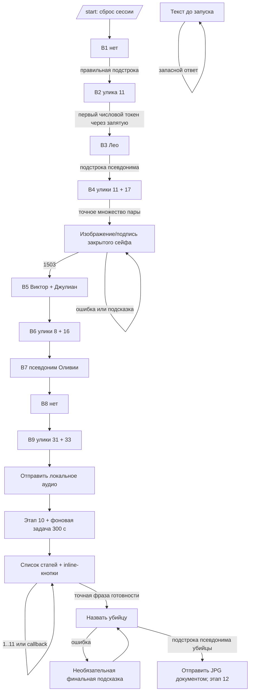
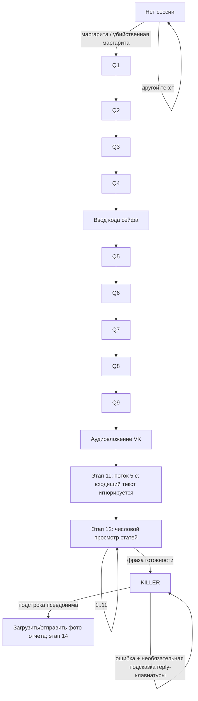
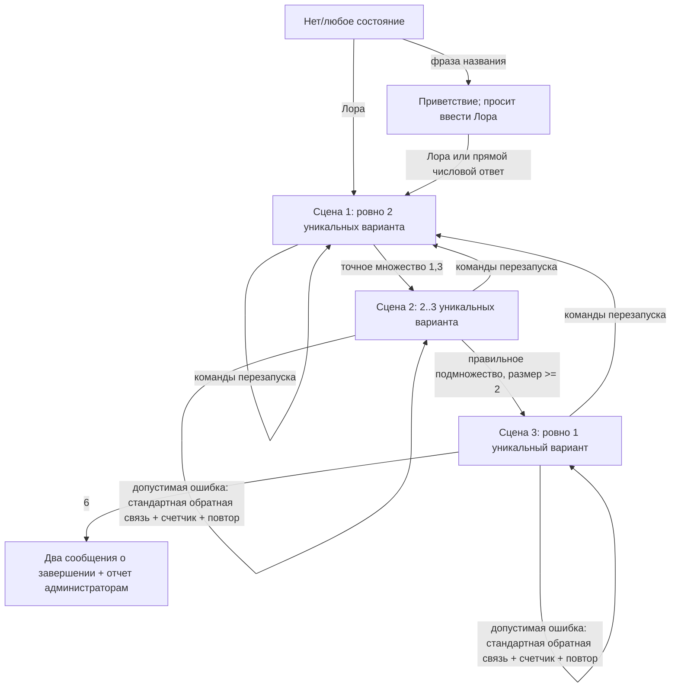

# Аудит текущего состояния: SobolevBots

Дата аудита: 2026-08-30  
Область аудита: обратный инжиниринг текущего рабочего пространства только для чтения. Рабочий код, зависимости, конфигурация развертывания и игровая логика не изменялись.

Используемые ниже метки доказательности:

- **Наблюдается:** непосредственно установлено по сохраненным в репозитории исходному коду, конфигурации или журналам.
- **Вероятно:** обоснованная интерпретация, не доказанная репозиторием.
- **Невозможно определить по репозиторию:** отсутствуют данные, необходимые для вывода.

## 1. Резюме

**Наблюдается:** рабочее пространство содержит три независимые монолитные точки входа ботов:

1. `killing_margo/tg/main.py` — Telegram, асинхронный `aiogram==3.30.0`, данные FSM в Redis.
2. `killing_margo/vk/main.py` — VK, синхронный `vk_api`, словари в памяти процесса.
3. `lora_dein/main.py` — VK, синхронный `vk_api`, словари в памяти процесса.

Нет общего приложения, общего средства выбора игры, общего игрового движка, общего пакета контента или общего слоя хранения. Каждый файл VK создает собственную сессию VK и цикл long polling при импорте модуля. Манифесты зависимостей и развертывания есть только у реализации Telegram.

Текущие игры значительно проще универсального повествовательного движка:

- `killing_margo` — преимущественно линейная последовательность из девяти вопросов, прерываемая вводом кода сейфа, после которой следуют аудиоулика, отложенный просмотр статей, вопрос об имени убийцы и финальный отчет.
- `lora_dein` — три линейные сцены с множественным выбором. Единственное зависящее от контента ветвление — обратная связь для конкретных неверных комбинаций в сцене 1. Также подсчитываются неверные выборы.

Минимальный движок, оправданный текущим поведением, должен поддерживать сцены, упорядоченные действия вывода, правила ввода, правила исходов, переходы, переменные сессии и ссылки на медиа. Сейчас ему **не нужны** произвольные скрипты, язык запросов к графам, системы инвентаря/экономики, симуляция NPC, сохраняемые таймеры в виде универсального планировщика или платформа event sourcing.

Наиболее важные эксплуатационные выводы:

- Оба токена доступа VK жестко заданы в отслеживаемом исходном коде Python (`killing_margo/vk/main.py`, строки ~25-34; `lora_dein/main.py`, строки ~23-31). Серьезность: **ВЫСОКАЯ**.
- Обе игры VK теряют весь прогресс игроков и счетчики при перезапуске процесса, поскольку состояние хранится только в глобальных переменных модуля.
- Все четыре локальных файла, на которые ссылается `killing_margo` (`safe_closed.jpg`, `safe_open.jpg`, `Диктофонная запись с телефона Джулиана.mp3`, `финальный полицейский отчет.jpg`), отсутствуют в рабочем пространстве. Единственный доступный медиаобъект — жестко заданный ID аудиовложения VK.
- Константы вопросов/статей Margo при разборе как литералов Python эквивалентны по значениям байт-в-байт, но поведение во время выполнения разошлось: различаются семантика запуска/сброса, тип клавиатуры подсказок, принимаемые разделители, время финального этапа, передача медиа, обработка ошибок и поведение после завершения.
- VK использует `vk_api` синхронно через пользовательский Long Poll (`VkLongPoll`), а не асинхронную библиотеку и не сервер callback/webhook. Фиксации зависимостей VK и объявления версии нет.
- `lora_dein` принимает в сцене 2 любых двух из трех правильных подозреваемых, а не обязательно всех троих, поскольку успех определяется как правильное подмножество размером не менее двух.
- Ни одна реализация сейчас не предлагает будущий сценарий «выбрать расследование». «Выбор» распределен между тремя отдельными идентификаторами/процессами.

## 2. Структура репозитория

### 2.1 Фактическое дерево относящихся к аудиту файлов

```text
SobolevBots/
├── killing_margo/
│   ├── tg/
│   │   ├── main.py
│   │   ├── requirements.txt
│   │   ├── Dockerfile
│   │   ├── compose.yaml
│   │   ├── kustomization.yaml
│   │   ├── k8s/
│   │   │   └── bot-deployment.yaml
│   │   ├── .env.example
│   │   ├── README.md
│   │   ├── .dockerignore
│   │   └── .gitignore
│   └── vk/
│       ├── main.py
│       └── bot_debug.log
└── lora_dein/
    ├── main.py
    └── bot_debug.log
```

**Наблюдается:** до создания этого отчета в рабочем пространстве было 14 файлов и не было сохраненных в репозитории изображений, аудио, видео, PDF или офисных документов. Нет корневого `README`, `pyproject.toml`, `setup.py`, `Pipfile`, lock-файла, конфигурации CI, конфигурации compose/Kubernetes для VK или набора тестов.

### 2.2 Точки входа

| Точка входа | Вызов | Модель выполнения | Доказательство |
|---|---|---|---|
| `killing_margo/tg/main.py` | `asyncio.run(main())` | асинхронный polling Telegram | строки ~564-597 |
| `killing_margo/vk/main.py` | `main()` | синхронный long polling VK и потоки | строки ~673-711 |
| `lora_dein/main.py` | `main()` | синхронный long polling VK и поток heartbeat | строки ~349-378 |

### 2.3 Объявленные и предполагаемые зависимости

`killing_margo/tg/requirements.txt` объявляет ровно:

- `aiogram==3.30.0`
- `aiohttp-socks==0.12.0`
- `redis==8.1.0`

Docker-образ Telegram — `python:3.12-slim`; он устанавливает этот файл requirements и запускает `python main.py` от имени непривилегированного пользователя (`killing_margo/tg/Dockerfile`, строки ~1-16).

Обе реализации VK импортируют `vk_api`; трассировки дополнительно показывают его синхронный стек `requests`/`urllib3` (`killing_margo/vk/bot_debug.log`, строки ~181-243 и ~312-374; `lora_dein/bot_debug.log`, строки ~103-180 и ~235-297).

**Невозможно определить по репозиторию:** версию установленного пакета `vk_api`. Ни один каталог VK не содержит метаданных зависимостей.

### 2.4 Конфигурация развертывания

- Compose запускает Telegram вместе с `redis:7-alpine`, включает Redis AOF, хранит `/data` в именованном томе `redis-data` и перезапускает оба сервиса, пока они не остановлены (`killing_margo/tg/compose.yaml`).
- Kustomize создает `bot-secrets` из неотслеживаемого `.env` (`killing_margo/tg/kustomization.yaml`).
- Kubernetes развертывает одну реплику бота со стратегией `Recreate`, init-контейнером ожидания Redis, корневыми файловыми системами только для чтения, ограничениями ресурсов и `REDIS_URL=redis://tgbots-redis:6379/0` (`killing_margo/tg/k8s/bot-deployment.yaml`).
- **Наблюдается:** среди ресурсов Kustomize нет Redis Service/Deployment/StatefulSet с именем `tgbots-redis`. **Невозможно определить по репозиторию:** предоставляется ли он извне.

## 3. Текущая архитектура выполнения

### 3.1 Telegram

`killing_margo/tg/main.py` объединяет:

- константы контента (`EVIDENCE_LIST`, `QUESTIONS`, `ARTICLES`, `KILLER_NAMES`, строки ~30-214);
- значения сессии по умолчанию и владение фоновыми задачами (строки ~216-232);
- рендеринг Telegram, клавиатуры и медиа (строки ~235-331);
- игровые правила и переходы (строки ~334-559);
- запуск процесса и подключение Redis (строки ~562-597).

Приложение использует обработчики `Router` и `Dispatcher.start_polling()`. `AiohttpSession` при наличии использует `TELEGRAM_PROXY` и тайм-аут 60 секунд. `BOT_TOKEN` обязателен; адрес Redis по умолчанию — `redis://redis:6379/0` (`main.py`, строки ~564-581).

`EVIDENCE_LIST` не используется ни одним обработчиком ни в одной реализации Margo. Бот предполагает, что нумерованный каталог улик доступен в физической игре, вместо его цифровой отправки.

### 3.2 VK

Оба файла VK:

- глобально создают экземпляры `vk_api.VkApi`, `get_api()` и `VkLongPoll`;
- блокируются в `for event in longpoll.listen()`;
- получают события `VkEventType.MESSAGE_NEW`;
- отправляют сообщения через синхронный `vk.messages.send(...)`;
- записывают `bot_debug.log` относительно рабочего каталога процесса;
- запускают ежечасный поток heartbeat.

Margo дополнительно запускает недемонический поток для отложенных статей и загружает локальные фотографии через `VkUpload.photo_messages()` (`killing_margo/vk/main.py`, строки ~305-318, ~631-639). В текущей Lora нет рендеринга медиа или клавиатур.

### 3.3 Текущая топология приложения

**Наблюдается:** существуют три идентификатора/конфигурации, а не один идентификатор Telegram и один идентификатор VK:

```text
Токен Telegram Margo -> монолит Margo TG -> Redis
Токен VK Margo       -> монолит Margo VK -> память процесса
Токен VK Lora        -> монолит Lora VK  -> память процесса
```

Нет межплатформенного пространства имен сессий, идентификатора игры в сохраняемом состоянии и маршрута из одной игры в другую.

## 4. killing_margo Telegram — поведение

Основное доказательство: `killing_margo/tg/main.py`.

### 4.1 Запуск и инициализация сессии

`/start` обрабатывается в любой момент. Команда заменяет данные FSM следующими:

```text
step=1
safe_opened=false
awaiting_hint=false
hint_question=null
temp_selected=[]
```

Затем бот отправляет вступление и вопрос 1 одним текстовым сообщением (`start`, строки ~415-424). Это безусловный повторный запуск/сброс, в том числе после завершения.

До `/start` на текст приходит ответ «Напишите /start…» (`handle_text`, строки ~427-435). Для нетекстового ввода нет подходящего обработчика, поэтому он игнорируется без ответа.

### 4.2 Последовательность вопросов

Весь входящий текст нормализуется только через `strip().lower()` (строки ~427-431).

| Этап | Вход/вывод | Ожидаемый ввод и принимаемые значения | Поведение при неверном/частично верном ответе | Переход |
|---|---|---|---|---|
| 1 | Вступление + «следы ботинками … убийца?» | совпадение подстроки `нет` или `не` | Текст ошибки, затем предложение подсказки | 2 |
| 2 | Запрос номера улики | разделение по запятой; сохраняются только поля из цифр; первое сохраненное число должно быть `11` | Текст ошибки + предложение подсказки | 3 |
| 3 | Вопрос, кто приходил после смерти | подстрока из `лео`, `лео миллер`, `брат елены`, `еленин брат` | Текст ошибки + предложение подсказки | 4 |
| 4 | Запрос двух номеров улик | ровно два токена через запятую либо через литерал ` и ` при отсутствии запятой; множество должно быть `{17,11}` | один правильный токен дает специальную обратную связь без подсказки; иначе ошибка + предложение подсказки | ввод кода сейфа |
| Сейф | Отправка `safe_closed.jpg` + подпись; запрос 4 цифр | точный нормализованный текст `1503`; точное `подсказка` показывает прямую подсказку к сейфу | неверный код повторяет только текст ошибки; состояние остается на вводе кода | вопрос 5 |
| 5 | Вопрос о двух лжецах | ровно два токена через запятую/` и `; точное множество должно совпасть с одной указанной парой полных-полных или кратких-кратких псевдонимов | Текст ошибки + предложение подсказки | 6 |
| 6 | Запрос двух номеров улик | точное множество `{8,16}`, запятая или ` и ` | специальная обратная связь о частичном ответе либо ошибка + подсказка | 7 |
| 7 | Вопрос о владельце «Аптеки» | подстрока одного из девяти псевдонимов Оливии/соседки | Текст ошибки + подсказка | 8 |
| 8 | Вопрос, могла ли Оливия убить Елену | подстрока `нет` или `не` | Только текст ошибки; без подсказки | 9 |
| 9 | Запрос двух номеров улик | точное множество `{33,31}`, запятая или ` и ` | специальная обратная связь о частичном ответе либо ошибка; без подсказки | этап статей |

Доказательства: `QUESTIONS`, строки ~78-159; `handle_safe`, строки ~334-351; `parse_pair`/`check_answer`, строки ~362-401; основной блок переходов, строки ~463-504.

Важные наблюдаемые граничные случаи:

- Поскольку обычные проверки одиночных ответов используют поиск подстроки, `не`, `неточно` или любой текст с `не` проходит вопросы 1/8. `олео...` проходит проверку `лео`. Границы слов не используются.
- Этап 2 принимает `11,999` и даже `11,abc`; проверяется только первое поле из цифр, отделенное запятой. `999,11` не проходит.
- Проверки пар после требования двух разобранных токенов сравнивают множества. Повторяющиеся правильные значения, например `11,11`, не проходят.
- Вопрос 5 не смешивает степень полноты псевдонимов: `виктор, джулиан эванс` отклоняется, хотя семантически оба человека указаны верно.

### 4.3 Поведение подсказок

После большинства неверных ответов бот отправляет сообщение об ошибке, затем «Друг, тебе нужна подсказка?» с inline-кнопками Telegram `Да`/`Нет` и callback data `hint_yes`/`hint_no` (`ask_hint`, строки ~264-270).

Callback подтверждается, его сообщение по возможности удаляется, метаданные подсказки FSM очищаются, затем отправляется текст подсказки или отказа. После этого вопрос повторяется (`handle_hint_callback`, строки ~507-544). Финальные подсказки об убийце используют сигнальное значение `q_num=0`. Сигнальное значение `99` существует для сейфа, но ни один текущий путь его не устанавливает.

**Наблюдаемое граничное поведение:** `awaiting_hint` сохраняется, но никогда не используется для блокировки текстового ввода. Игрок может правильно ответить, пока старая клавиатура подсказки остается активной, продвинуться и нажать ее позже; такой callback может повторить более ранний вопрос уже после продвижения.

### 4.4 Финальный этап

После вопроса 9:

1. Отправляется текст о финишной прямой.
2. Отправляется локальный MP3 `Диктофонная запись с телефона Джулиана.mp3`.
3. Устанавливается этап 10.
4. Запускается внутрипроцессная задача, которая ожидает 300 секунд, отправляет напоминание, а затем список из 11 статей и inline-клавиатуру статей (`handle_text`, строки ~493-503; `delayed_articles`, строки ~403-413).

На этапе 10:

- число `1`–`11` сразу открывает статью, даже до появления отложенного списка;
- каждый inline-callback статьи также открывает статью; callbacks не ограничены текущим этапом;
- точный нормализованный текст `готов назвать убийцу` переводит на этап 11;
- другой текст просит игрока изучить статьи.

На этапе 11 совпадение по подстроке с `марк`, `марк дэвис`, `марк девис`, `джейкоб адамс`, `джейкоб`, `адамс` завершает игру, отправляет финальный отчет как **документ** Telegram и устанавливает этап 12. При неверных именах предлагается финальная подсказка. Для этапа 12 ветви нет, поэтому последующий текст молча игнорируется до `/start`.

### 4.5 Ошибки и задержки

- Для изображений сейфа проверяется существование файла, а при его отсутствии отправляется только текст подписи (`send_safe_photo`, строки ~280-286).
- Для аудио и финального отчета нет проверки существования или локальной обработки исключений (`send_audio_recording`, `send_final_report`, строки ~316-331).
- Обработчика ошибок уровня router нет.
- Фоновые задачи статей удерживаются в множестве уровня модуля во избежание сборки мусора, отменяются при штатном завершении работы и не сохраняются (`background_tasks`, строка ~224; завершение работы, строки ~586-593).
- `/start` сбрасывает прогресс в Redis, но не находит и не отменяет существующую отложенную задачу этого игрока. Поэтому задача из предыдущего прохождения может отправить напоминание/список статей в новую перезапущенную сессию.

## 5. killing_margo VK — поведение

Основное доказательство: `killing_margo/vk/main.py`.

### 5.1 Запуск и состояние

До запуска на любое сообщение приходит запрос кодового слова. Точное нормализованное `маргарита` или `убийственная маргарита` запускает игру только при `step == 0`; иначе бот отвечает «Вы уже в деле…» (`main`, строки ~681-696). `handle_start` устанавливает `step=1`, очищает метаданные подсказок и отправляет тот же текст вступления/вопроса, что и TG (строки ~436-446).

Команды перезапуска и сброса после завершения нет. Все состояние находится в `user_data` с ключом `event.user_id`.

### 5.2 Основная последовательность

Повествование, девять записей вопросов, статьи, псевдонимы убийцы и список из 41 улики идентичны Telegram как значения Python. Наблюдаемая последовательность в целом та же:

```text
кодовое слово -> В1 -> В2 -> В3 -> В4 -> сейф -> В5 -> В6 -> В7 -> В8 -> В9
-> аудио -> ожидание -> просмотр статей -> фраза готовности -> убийца -> отчет
```

После сейфа VK использует другие внутренние номера этапов (`step 6` означает вопрос 5), однако видимая игроку последовательность не меняется (`handle_safe`, строки ~413-421; `handle_message`, строки ~488-669).

Различия в обработке ввода:

- В1/В3/В7/В8/финальный убийца используют поиск подстроки в приведенном к нижнему регистру тексте.
- В2 проверяет первый отделенный запятой токен, состоящий только из цифр.
- В4/В6/В9 требуют запятую; в отличие от TG, они **не** принимают ` и `.
- В5 принимает запятую или литерал ` и `.
- Сейф проверяет исходный `text`, переданный из `main`, но `main` уже приводит его к нижнему регистру и обрезает пробелы; код `1503` проверяется точно.

### 5.3 Поведение VK API, медиа и клавиатуры

Фактически используемая библиотека: `vk_api`.

- **Синхронность/асинхронность:** синхронная.
- **События:** `vk_api.longpoll.VkLongPoll.listen()` и `VkEventType.MESSAGE_NEW`.
- **Текст:** `vk.messages.send(peer_id=..., message=..., random_id=...)`.
- **Фотографии:** `VkUpload(vk).photo_messages(local_path)`, затем `attachment="photo{owner_id}_{id}"`.
- **Аудио:** жестко заданное `attachment="audio46166014_456239718"`; без загрузки.
- **Клавиатуры:** `VkKeyboard(inline=False)`, `add_button("Да"/"Нет", color=...)`, сериализация через `get_keyboard()`. Это reply-клавиатура, а не callbacks.
- **Callbacks:** отсутствуют в текущем исходном коде VK.

Доказательства: импорты, строки ~1-4; вспомогательные функции отправки, строки ~294-318; клавиатура подсказок, строки ~328-341; аудио/отчет, строки ~376-410; цикл событий, строки ~681-696.

JPG отчета загружается и отправляется как фотография VK. При отсутствии файла отчета пользователь получает «Файл отчета не найден»; исключения загрузки показываются пользователю. Для загрузки фотографии сейфа нет проверки существования или границы обработки исключений.

### 5.4 Подсказки, статьи, завершение

Reply-кнопки подсказки создают обычные текстовые события. Когда установлено `awaiting_hint`, а текст точно равен `да` или `нет`, бот обрабатывает подсказку и повторяет вопрос (`handle_message`, строки ~459-486). Клавиатура явно не удаляется.

Подтвержден дефект смещения подсказок на единицу после сейфа:

- на этапе выполнения 6 (вопрос 5) неверный ответ вызывает `ask_hint(..., 6)`, поэтому предложение/повтор использует подсказку и текст вопроса 6, хотя состояние по-прежнему ожидает вопрос 5;
- на этапе выполнения 7 (вопрос 6) используются подсказка/текст вопроса 7, хотя состояние по-прежнему ожидает вопрос 6;
- на этапе выполнения 8 (вопрос 7) запрашивается вопрос 8, у которого подсказка пуста; `ask_hint` записывает предупреждение в журнал и не отправляет предложение подсказки.

Это наблюдаемое поведение, а не только внутренняя нумерация. Оно подтверждается в `handle_message`, строки ~535-595, вместе с `ask_hint`/`send_hint`, строки ~328-351; предупреждение также присутствует в `killing_margo/vk/bot_debug.log`, строки ~101-104.

После В9 отправляется аудио, и новый поток засыпает на **5 секунд**, несмотря на комментарий о том, что в рабочей среде должно быть 300. Во время ожидания пользователь остается на этапе 11, для которого нет ветви ввода; сообщения молча игнорируются. Затем поток отправляет список статей и устанавливает этап 12 (`строки ~625-639`).

Статьи выбираются только числовым текстом; клавиатуры нет. При завершении загружается финальный отчет, отчет об ошибках печатается/отправляется администраторам и устанавливается этап 14. Последующие сообщения молча игнорируются. Структуры Margo `user_errors` и `user_info` никогда не заполняются игровым путем, поэтому отчет о завершении фактически содержит неизвестного пользователя и ошибки `0/0/0` (`строки ~39-41, ~66-81, ~655-668`).

## 6. Анализ соответствия killing_margo TG/VK

### 6.1 Подтвержденное соответствие

- Значения 41 строки улик, девяти словарей вопросов, 11 словарей статей и шести псевдонимов убийцы идентичны.
- Порядок повествования и семантически правильные ответы совпадают.
- Неверные ответы не продвигают основной этап.
- Частично верные пары улик получают отдельную обратную связь без основного перехода.
- Обе реализации предлагают подсказки для вопросов с непустым содержимым подсказки и финальную подсказку об убийце.
- Обе используют один код сейфа и одинаковые имена локальных изображений сейфа.

### 6.2 Подтвержденные различия

| Область | Поведение TG | Поведение VK | Вероятная причина | Нужно решение человека? |
|---|---|---|---|---|
| Запуск | `/start` всегда сбрасывает | кодовое слово запускает только на этапе 0 | соглашение платформы / расхождение копий | **Да:** единая политика повторного прохождения |
| Ответ до запуска | просит ввести `/start` | просит кодовое слово с коробки | платформенный вариант текста | **Да:** знакомство пользователя с продуктом |
| После завершения | текст игнорируется; `/start` работает | весь обычный текст игнорируется; на кодовое слово сообщается, что дело уже начато | отсутствует обработка терминального состояния | **Да** |
| Интерфейс подсказок | inline-кнопки callback; callback подтверждается/удаляется | постоянная reply-клавиатура; текст `да/нет` | возможности API платформ | Только решение о рендеринге |
| Подсказки после сейфа | В5–В7 используют собственные подсказки и повторяют собственные вопросы | смещение на единицу: В5 показывает/повторяет содержимое В6; В6 — В7; В7 не создает предложения | расхождение индексов этапа/вопроса | **Да:** сохранить дефект или канонический замысел |
| Разделитель пар В4/В6/В9 | запятая или ` и ` | только запятая | обобщенный `parse_pair` в TG; скопированные ветви VK | **Да:** наблюдаемое расхождение принимаемого ввода |
| Интерфейс статей | 11 inline-кнопок и числовой ввод | только числовой ввод | более позднее улучшение TG | **Да:** желаемый UX; рендеринг адаптеров различается |
| Задержка | 300 секунд | 5 секунд | в коде оставлено явное тестовое значение VK | **Да:** каноническая длительность |
| Во время задержки | уже этап статей; числа/готовность принимаются | нет обработчика этапа 11; ввод игнорируется | разное время перехода | **Да** |
| Источник аудио | отсутствующий локальный MP3 с именем, ссылающимся на телефон Джулиана | жестко заданный ID аудио VK; подпись говорит о записи Елены/Кевина Джулианом | различие платформенного хранения; точная эквивалентность не проверена | **Да:** определить канонический ресурс |
| Финальный отчет | отсутствующий локальный JPG отправляется документом; исключение распространяется | локальный JPG загружается как фото; при отсутствии/ошибке пользователю отправляется запасной ответ | реализация конкретного адаптера | Политика рендеринга; решение о ресурсе |
| Отсутствие медиа сейфа | запасной вариант только с подписью | ошибка загрузки может завершить основной цикл | несогласованная обработка ошибок | **Да:** политика запасного поведения |
| Состояние | данные JSON в Redis, без TTL | словарь модуля, теряется при перезапуске | Telegram был подготовлен к эксплуатации позже | Нет для соответствия; да для миграции |
| Конкурентность | изоляция событий aiogram по сессиям; async-задача | основной синхронный цикл + поток задержки с общим состоянием | модель библиотеки/выполнения | Инфраструктурное решение |
| Журналирование/администрирование | журнал stdout; без переписки игрока | файл/stdout; ввод игроков и уведомления администраторам | эксплуатационные дополнения VK | **Да:** политика конфиденциальности/эксплуатации |
| Маршрутизация пользователя/чата | отправка в `from_user.id` | отправка в `user_id`/peer события | обе предполагают личный чат | **Да:** область поддержки групповых чатов |
| Ответ на ошибку | нет глобального обработчика | критическая запись/уведомление администраторам верхнего уровня, затем процесс завершается | независимые копии | **Да:** общий контракт надежности |

**Наблюдаемое расхождение с доказательствами из репозитория:** журналы VK доказывают, что пятисекундная последовательность выполнялась, и показывают успешную отправку аудио/отчета (`killing_margo/vk/bot_debug.log`, строки ~29-44, ~68-80, ~250-286). Они также показывают, что тайм-ауты чтения long poll завершают процесс (`строки ~151-245 и ~286-376`).

**Невозможно определить по репозиторию:** какая платформа является канонической для продукта там, где поведение различается. Идентичный контент не доказывает авторитетность какой-либо копии времени выполнения.

## 7. lora_dein VK — поведение

Основное доказательство: `lora_dein/main.py`.

### 7.1 Запуск, перезапуск и завершение

Существуют две похожие на запуск фразы:

- `лора дейн` / `убийство лоры дейн`: устанавливает сцену 1, очищает ошибки, отправляет приветствие с просьбой написать `Лора`.
- `лора`: получает данные профиля VK, сбрасывает сцену 1/ошибки, записывает имя/username, уведомляет администраторов и отправляет сцену 1.

Поскольку `лора` обрабатывается до текущей сцены, эта фраза также перезапускает игру с любого этапа. Явные `/restart`, `рестарт` или `заново` сбрасывают игру до сцены 1 и отправляют ее. После завершения обычный текст получает стандартный запрос кодового слова, а `лора` или перезапуск работают.

Доказательство: `handle_message`, строки ~270-340.

### 7.2 Общий для всех сцен разбор

`parse_answer` извлекает **все целочисленные подстроки** через `re.findall(r'\d+', text)`, отклоняет значения вне диапазона, удаляет дубликаты через `set` и проверяет количество уникальных выборов (`строки ~71-84`).

Следствия:

- запятая или пробелы фактически не обязательны;
- `варианты 1abc3` разбирается как `[1,3]`;
- повторяющийся ввод вроде `1,1,3` превращается в `{1,3}` и может пройти;
- порядок отбрасывается;
- выглядящее отрицательным `-1` дает `1`;
- при неверном формате отправляется сообщение о формате, но счетчик ошибок не увеличивается и полная сцена не повторяется.

### 7.3 Сцена 1 — доказать невиновность Томми

При входе отправляются шесть пронумерованных утверждений и запрашиваются ровно два. Правильные номера — 1 и 3 (`scenes["scene1"]`, строки ~87-143).

Для успеха требуется выбранное множество `{1,3}`; отправляется текст успеха сцены («Открывайте дополнительный конверт №1!»), затем сразу сцена 2.

Неверные допустимые пары:

- увеличивают `user_errors[user_id]["scene1"]`;
- выбирают подробную обратную связь по отсортированной паре;
- если точной обратной связи для пары нет, предпочитают первую доступную подсказку с одним правильным вариантом;
- в противном случае используют стандартный текст неудачи;
- повторяют всю сцену.

Для каждой пары с правильным вариантом 1 или 3 и одним неверным вариантом есть явные тексты обратной связи. Несколько ключей подсказок с обратным порядком и записи подсказок об успехе `(0,2)` недостижимы, поскольку варианты сортируются, а успешные выборы возвращают управление до `get_hint`.

Недостижимая подсказка успешной пары говорит «Открывайте второй конверт!», а достижимый текст успеха сцены — «Открывайте дополнительный конверт №1!». По репозиторию нельзя установить, какая формулировка о конверте каноническая. Массивы `options_full` во всех трех сценах также никогда не читаются; видимые игроку варианты берутся из заранее форматированных полей `text`.

### 7.4 Сцена 2 — определить подозреваемых с мотивом

Шесть подозреваемых: Рита Морган, Ван Ли, Винсент Кроули, Карл Брукс, Томми Вайс и Глория Фэрроу. Правильные варианты — 1, 2 и 6. Ввод может содержать два или три уникальных числа.

Предикат успеха:

```text
selected_set является подмножеством {1,2,6}
И количество выбранных >= 2
```

Поэтому `{1,2}`, `{1,6}`, `{2,6}` и `{1,2,6}` проходят. Это реальная пороговая механика, а не точное равенство множеств (`check_selection`, строки ~224-253). Любой допустимый выбор с неверным подозреваемым не проходит, увеличивает число ошибок сцены 2, отправляет стандартный текст неудачи и повторяет сцену.

### 7.5 Сцена 3 — определить убийцу

Разрешено ровно одно уникальное число. Успех дает только 6 (Глория Фэрроу). Неверные допустимые выборы увеличивают число ошибок сцены 3, отправляют стандартный текст неудачи и повторяют сцену.

При успехе отправляются:

1. настроенный текст успеха «откройте финальный конверт с признанием»;
2. “Вы успешно завершили расследование! Спасибо за игру!”

Затем сохраняется `"completed"`, а администраторам отправляются количества ошибок по сценам и идентификатор игрока (`строки ~244-253`).

### 7.6 Поведение платформы/API и будущий рендеринг Telegram

Текущее поведение VK — только текстовое. Нет клавиатур, callbacks, отправки/загрузки медиа, задержек в игровом процессе, Redis или локальных ресурсов. `vk.users.get(...)` — единственный дополнительный вызов API, используемый для административной телеметрии.

Механики, которые общий движок мог бы автоматически отобразить в Telegram:

- три упорядоченные сцены;
- нумерованные списки вариантов;
- извлечение и проверка числовых выборов;
- точные/пороговые предикаты успеха;
- зависящая от комбинации обратная связь сцены 1;
- счетчики неверных попыток;
- повторение сцены;
- переходы перезапуска и завершения.

Задачи адаптера Telegram:

- сопоставить текстовый вывод с сообщениями Telegram;
- решить, останутся ли варианты вводимым текстом или станут reply/inline-кнопками;
- сопоставить идентификатор игрока/чата Telegram;
- реализовать соглашения Telegram о командах/запуске/перезапуске;
- отображать подтверждение callback, если выбраны inline-кнопки.

Дополнительные решения автора/продукта:

- намеренно ли сцена 2 принимает любых двух из трех подозреваемых;
- намеренен ли двухэтапный запуск «название игры, затем Лора»;
- должен ли сохраняться перезапуск простым вводом `лора`;
- нужен ли администраторам сбор имен игроков и количества ошибок;
- должны ли в Telegram быть медиа — в текущем поведении Lora они отсутствуют и не упоминаются.

Текущий репозиторий не доказывает необходимость дополнительных ресурсов Telegram.

## 8. Карты игрового процесса

### 8.1 killing_margo Telegram



При каждом неверном ответе В1–В7 с непустой подсказкой необязательная подпоследовательность подсказки возвращает к тому же вопросу. Неверные ответы В8/В9 просто оставляют игрока на месте. Частично верные пары улик остаются на месте и получают отдельную обратную связь.

### 8.2 killing_margo VK



Подробные условия вопросов соответствуют разделу 5. Пути подсказок при неверных ответах после сейфа демонстрируют описанное в разделе 5.4 смещение на единицу. После запуска сессии начальным кодовым словом путь повторного прохождения недостижим.

### 8.3 lora_dein VK



## 9. Семантика сопоставления ввода и ответов

| Поведение | Margo TG | Margo VK | Lora VK |
|---|---|---|---|
| Начальная нормализация | `strip().lower()` | main и обработчик применяют lower/strip | `strip().lower()` |
| `casefold()` | Нет | Нет | Нет |
| `ё` → `е` | Нет | Нет | Нет |
| Удаление пунктуации | Нет | Нет | Regex игнорирует нецифровые символы в числовых сценах |
| Границы слов | Нет | Нет | Н/П |
| Одиночный текстовый ответ | подстрока псевдонима | подстрока псевдонима | Н/П |
| Одиночный числовой ответ | первое поле только из цифр через запятую для В2 Margo | то же | все целочисленные подстроки с удалением дубликатов |
| Точная пара | равенство множеств после разделения | равенство множеств после разделения запятыми | предикат множества сцены 1 |
| Разделители пар | запятая, иначе литерал ` и ` | В5 поддерживает ` и `; пары улик — только запятая | любые нецифровые разделители |
| Несколько псевдонимов | явные строки | те же явные строки | только нумерованные варианты |
| Чувствительность к порядку | В2 — да (первое поле); пары — нет | то же | нет |
| Пробелы | обрезаются снаружи и в каждом токене | то же | несущественны вокруг цифр regex |
| Неверный ответ продвигает | Нет | Нет | Нет |

Возможные конфликты:

- Margo проверяет `не` как подстроку, что шире `нет`; порядок не защищает от этого, поскольку проходит любое из них.
- Псевдонимы убийцы Margo включают варианты личности и прежнего имени; проходит любое предложение, содержащее один из них.
- В5 Margo принимает только явно заданные пары краткая-краткая или полная-полная.
- Преобразование в `set` в Lora делает семантику дубликатов и порядка неявной, а порядок возвращаемого списка — недетерминированным, хотя последующие проверки используют множества/отсортированные значения.

## 10. Кнопки и callbacks

### Telegram Margo

- Inline-клавиатура подсказок: callback data `hint_yes`, `hint_no`.
- Inline-клавиатура статей: callback data от `article_0` до `article_10`.
- Оба обработчика callback вызывают `callback.answer()`.
- Callback подсказки по возможности удаляет сообщение с клавиатурой; клавиатура статей остается.
- Запросы callback не привязаны к версии игры, сцене, исходному сообщению или текущему этапу.
- Reply-клавиатур нет.

Доказательство: построители клавиатур, строки ~237-255; callbacks, строки ~507-559.

### VK Margo

- Клавиатура подсказок — `VkKeyboard(inline=False)` с положительной/отрицательной текстовыми кнопками.
- Нажатия кнопок обрабатываются как обычный текст `MESSAGE_NEW`.
- Нет обработчика payload/callback и явного удаления клавиатуры.
- Статьи выбираются только текстом.

### VK Lora

В текущем коде нет кнопок, импортов клавиатур, событий callback или обработчиков callback. Старые записи журнала упоминают историческую ошибку `VkEventType.MESSAGE_EVENT`, но этого кода нет в текущем исходнике (`lora_dein/bot_debug.log`, строки ~1-28). Ее нельзя считать текущим поведением.

## 11. Инвентаризация медиа

### 11.1 Упоминаемые ресурсы

| Ресурс/ссылка | Игра/платформа | Назначение | Передача | Есть локально? | Доказательство |
|---|---|---|---|---|---|
| `safe_closed.jpg` | Margo TG/VK | ввод кода закрытого сейфа и повтор подсказки | локальное фото TG; загрузка фото VK | **Нет** | TG, строки ~485-492, ~537-544; VK ~473-484, ~522-526 |
| `safe_open.jpg` | Margo TG/VK | успешное открытие сейфа | локальное фото TG; загрузка фото VK | **Нет** | TG ~343-350; VK ~413-419 |
| `Диктофонная запись с телефона Джулиана.mp3` | Margo TG | финальная аудиоулика | локальный `FSInputFile`, `send_audio` | **Нет** | TG ~316-322 |
| `audio46166014_456239718` | Margo VK | финальная аудиоулика | ID вложения VK | только удаленный ID | VK ~376-389 |
| `финальный полицейский отчет.jpg` | Margo TG/VK | отчет о завершении | документ TG; загруженное фото VK | **Нет** | TG ~325-331; VK ~392-410 |

Lora не ссылается на изображения, аудио, видео или документы.

### 11.2 Дублирующиеся медиа

**Наблюдается:** бинарных ресурсов нет, поэтому невозможно проверить хэши файлов и визуальную/аудиоэквивалентность. На двух платформах дублируются *имена/ссылки* изображений сейфа и финального отчета, но не сохраненные в репозитории файлы.

**Невозможно определить по репозиторию:**

- являются ли MP3 TG и вложение VK одной записью;
- доступно ли удаленное вложение VK идентификатору бота;
- существуют ли отсутствующие локальные файлы только в контекстах сборки развертывания вне этого рабочего пространства;
- имеют ли русские имена файлов одинаковую нормализацию Unicode в рабочих файловых системах.

## 12. Redis и текущее хранение состояния

### 12.1 Telegram Margo

`RedisStorage.from_url(redis_url)` используется и как хранилище FSM, и для изоляции событий (`killing_margo/tg/main.py`, строки ~575-581).

Сохраняемые данные приложения:

| Поле | Значение | Фактически изменяется? |
|---|---|---|
| `step` | текущий вопрос/ввод кода/финальный этап, 0–12 | Да |
| `safe_opened` | отличает ввод кода сейфа на этапе 5 от вопроса 5 | Да |
| `awaiting_hint` | отмечает ожидающее предложение подсказки | Да, но не блокирует текст |
| `hint_question` | номер вопроса; `0` — финал; `99` предназначено для сейфа | Да; путь `99` не используется |
| `temp_selected` | пустой список | Только инициализируется; не используется |

При стандартном построителе ключей aiogram ключ данных:

```text
fsm:<chat_id>:<user_id>:data
```

Это строка Redis с JSON. `data_ttl` не передается, поэтому настроенного приложением срока действия нет. Код никогда не вызывает `state.set_state`, следовательно, значение FSM `...:state` намеренно не используется. Изоляция событий использует временный ключ:

```text
fsm:<chat_id>:<user_id>:lock
```

со стандартным 60-секундным тайм-аутом блокировки Redis в aiogram. Стандартный построитель ключей не включает ID бота и платформу. Доказательство в репозитории: стандартные `RedisStorage.from_url` и `create_isolation`, строки ~575-581; поведение фреймворка соответствует зафиксированным стандартным значениям aiogram 3.30.

Детали идентификации:

- Стандартная стратегия хранения aiogram — пользователь в чате, поэтому ключи содержат и ID чата, и ID пользователя.
- Вспомогательные функции исходящих игровых сообщений используют `message.from_user.id`, а не `message.chat.id`; таким образом, реализация предполагает прямой/личный чат.
- В личном чате Telegram ID чата и ID пользователя обычно являются одним числовым ID, что дает повторяющуюся пару в ключе.
- Идентификатора игры нет, поэтому две игры, использующие это хранилище/построитель ключей под одним ботом, могут конфликтовать.

Очистка/сброс:

- `/start` перезаписывает запись данных JSON, но не удаляет ее.
- После завершения сохраняется `step=12`.
- Нет TTL, явного удаления, истории сессии или очистки устаревших сессий.
- AOF и именованный том Compose сохраняют Redis между перезапусками контейнера; удаление тома удаляет прогресс.

### 12.2 Состояние вне Redis

| Состояние | Расположение | Поведение при сохранении/перезапуске |
|---|---|---|
| Отложенные задачи статей TG | множество `background_tasks` уровня модуля | теряются/отменяются при перезапуске; не планируются заново |
| Прогресс/подсказки Margo VK | словарь `user_data` | теряются при перезапуске |
| Ошибки/профиль Margo VK | словари `user_errors`, `user_info` | теряются; также не заполняются текущим процессом |
| Текущая сцена Lora VK | словарь `user_progress` | теряется при перезапуске |
| Счетчики ошибок/профиль Lora VK | словари `user_errors`, `user_info` | теряются при перезапуске |
| Время запуска бота | глобальная переменная модуля | сбрасывается при перезапуске |
| История журнала | относительный локальный `bot_debug.log` | зависит от файловой системы; не является состоянием сессии |

Локальная база данных/файл состояния не используется.

### 12.3 Состояние, которое должен представлять будущий слой хранения

Подтвержденные текущие потребности:

- платформа и платформенный идентификатор пользователя (а также чат/peer, если они различаются);
- выбранная игра, когда один идентификатор обслуживает несколько игр;
- текущая сцена/этап;
- переменные/флаги сессии (`safe_opened`, метаданные ожидающей подсказки);
- счетчики (неверные попытки Lora);
- терминальный/завершенный статус;
- срок выполнения отложенного действия, если отложенная улика Margo должна переживать перезапуск.

Вероятные потребности миграции:

- версия игры/контента, привязанная к сессии, поскольку Margo уже демонстрирует расхождение копий, а активные сессии не должны менять смысл посреди прохождения.

Хранилище событий/истории **не требуется текущим поведением для игрока**. В дальнейшем оно может поддерживать аналитику/аудит, но текущему коду нужны только суммарные количества ошибок и текущий прогресс.

## 13. Матрица возможностей

| Возможность / механика | killing_margo TG | killing_margo VK | lora_dein VK |
|---|---|---|---|
| Текстовые сообщения | Да | Да | Да |
| Изображения | локальные изображения сейфа | локальные изображения сейфа | Нет |
| Аудио | локальный MP3 | жестко заданное вложение VK | Нет |
| Видео | Нет | Нет | Нет |
| Документы | JPG отправляется документом | Нет; JPG как фото | Нет |
| Reply-клавиатуры | Нет | Подсказка Да/Нет | Нет |
| Inline-клавиатуры | Подсказки и статьи | Нет | Нет |
| Callbacks | `hint_*`, `article_*` | Нет | Нет |
| Команды/кодовые слова | `/start`, фраза готовности | два стартовых кодовых слова, фраза готовности | фразы названия/Lora/перезапуска |
| Несколько принимаемых ответов | псевдонимы и неупорядоченные пары | те же псевдонимы/пары контента | множества числовых вариантов |
| Нормализация ответа | lower + strip | lower + strip | lower + strip + regex цифр |
| Ответ на ошибку | фиксированный, частичный, необязательная подсказка | та же общая модель | особый для комбинации в сцене 1; иначе стандартный |
| Продвижение состояния | линейное с вводом кода сейфа/финала | линейное с вводом кода сейфа/финала | три линейные сцены |
| Ветвление | выбор подсказки; просмотр статей | выбор подсказки; просмотр статей | обратная связь для неверной комбинации |
| Необязательные действия | подсказки; чтение любых статей | подсказки; чтение любых статей | перезапуск |
| Счетчики | Нет | структуры есть, но не используются | допустимые неверные выборы по сценам |
| Флаги/факты | флаги сейфа/подсказки | флаги подсказки; сейф закодирован этапом | ничего, кроме сцены/завершения |
| Повтор/сброс | `/start` всегда | отсутствует после запуска | `Лора` и явный перезапуск |
| Завершение игры | отчет, затем молчащий терминальный этап | отчет/уведомление администраторам, затем молчащий терминальный этап | запрос признания + благодарность + уведомление администраторам |
| Хранение в Redis | Да | Нет | Нет |
| Журналирование | INFO в stdout | файл + stdout + текст сообщений | файл + stdout |
| Исключения | нет глобального обработчика | широкая обработка верхнего уровня; обработка во вспомогательных функциях | широкая обработка верхнего уровня |
| Отложенные сообщения | async-задача 300 с | поток 5 с | Нет |
| Вызовы внешних API | Telegram Bot API, Redis | VK API/загрузка/Long Poll | VK API/Long Poll/users.get |
| Выбор игры | Нет | Нет | Нет |

## 14. Классификация

### A. Игровой контент

- Все названия улик Margo, строки вопросов/запросов/успеха/неудачи/подсказок, принимаемые псевдонимы, заголовки/тексты статей, имена убийцы, код сейфа, подписи медиа и имена файлов/ID вложения.
- Все тексты сцен Lora, подозреваемые/варианты, номера правильных вариантов, объяснения для конкретных комбинаций, указания о конвертах.

Доказательство: константы Margo в TG, строки ~30-214 / VK ~107-289; `scenes` Lora, строки ~86-198.

### B. Игровые механики

- Сопоставление одного из нескольких псевдонимов по подстроке.
- Проверка неупорядоченных точных пар.
- Проверка «как минимум N правильных вариантов без неправильных».
- Выдача специальной обратной связи для частичного ответа/комбинации без продвижения.
- Повтор сцены после неудачи.
- Предложение/отклонение подсказки.
- Ввод кода сейфа и флаг `safe_opened`.
- Просмотр необязательных статей без продвижения.
- Задержка/разблокировка улики.
- Увеличение счетчиков неверных попыток.

### C. Задачи платформенного адаптера

- aiogram `Message`, `CallbackQuery`, фильтры, подтверждение/удаление callback.
- Telegram `InlineKeyboardMarkup`, `FSInputFile`, `send_photo/audio/document`.
- VK `VkLongPoll`, извлечение пользователя/peer из события, `random_id`.
- VK `VkKeyboard`, обычные текстовые события кнопок.
- VK `VkUpload.photo_messages` и форматирование ID вложения.
- Сопоставление типов медиа и запасного поведения с каждой платформой.

### D. Инфраструктура

- Подключение/хранение/изоляция Redis и жизненный цикл.
- Прокси/тайм-аут сессии Aiohttp.
- Окружение/секреты, Docker, Compose, Kustomize/Kubernetes.
- Журналирование, эксплуатационные уведомления администраторам, heartbeat процесса.
- Завершение процесса и владение задачами/потоками.

### E. Сквозное поведение приложения

- знакомство при запуске/вводе кодового слова;
- будущий выбор игры;
- идентификация/жизненный цикл/сброс/завершение сессии;
- маршрутизация ввода в выбранную игру;
- общая политика неподдерживаемого ввода и ошибок;
- политика конфиденциальности/телеметрии;
- выбор версии игры для возобновленных сессий.

## 15. Анализ дублирования

Архитектурно значимое дублирование:

1. **Игровой контент Margo дублируется между платформами.** 41 улика, девять вопросов, 11 статей и псевдонимы убийцы независимо встроены в оба файла, несмотря на текущее совпадение.
2. **Выполнение правил Margo дублируется.** Каждый файл отдельно реализует диспетчеризацию В1–В9, сопоставление пар, частичную обратную связь, ввод кода сейфа, просмотр статей и проверку убийцы. Это источник расхождений разделителей, времени и терминального поведения.
3. **Оболочка процесса VK дублируется между играми.** Токены/ID администраторов, глобальное создание сессии, журналирование в файл/stdout, время работы, heartbeat, уведомления администраторам, цикл long poll, широкая обработка исключений верхнего уровня и сообщения об остановке процесса присутствуют в обоих файлах VK.
4. **Метаданные и выполнение сцен VK Lora разделены лишь частично.** Универсальные `parse_answer`, `check_selection` и `send_scene` сосуществуют с большой матрицей сцены 1, встроенной в Python.
5. **Диспетчеризация по вопросам Margo дублируется внутри VK.** В4, В6 и В9 повторяют почти идентичный код точной пары/частичного совпадения в отдельных ветвях.
6. **Доставка медиа Margo дублируется и несогласованна.** Пути изображений сейфа/финала повторяются в обработчиках; локальные/удаленные медиа и правила запасного поведения зависят от платформы, но не представлены как общие семантические ресурсы.
7. **Логика запуска/сброса/сессии дублируется, но семантически расходится** во всех трех точках входа.

## 16. Риски унаследованной реализации

| Серьезность | Риск | Причина / доказательство |
|---|---|---|
| **ВЫСОКАЯ** | Жестко заданные токены VK | Полные токены, подобные bearer-токенам, находятся в обоих файлах VK `main.py` (~25-29); раскрытие репозитория может скомпрометировать идентификаторы. |
| **ВЫСОКАЯ** | Потеря прогресса VK | Весь прогресс, подсказки, счетчики и данные профиля находятся в словарях модуля; каждый перезапуск очищает активные игры. |
| **ВЫСОКАЯ** | Отсутствуют необходимые медиа | Все локальные ресурсы Margo отсутствуют; аудио/отчет TG и загрузка сейфа VK могут вызвать исключение; текущая копия не может обеспечить полное поведение. |
| **ВЫСОКАЯ** | Временные ошибки long poll VK завершают процесс | Обработчик верхнего уровня повторно возбуждает исключение; журналы показывают завершения из-за тайм-аута чтения/сброса соединения. |
| **ВЫСОКАЯ** | Неполная спецификация зависимостей VK | Нет манифеста версии/установки; поведение зависит от неизвестного окружения. Исторические журналы уже показывают ошибку совместимости API/событий. |
| **ВЫСОКАЯ** | Недолговечная отложенная улика | Задача TG на 300 с и поток VK на 5 с исчезают при перезапуске; игрок может навсегда остаться без предусмотренного показа статей. |
| **СРЕДНЯЯ** | Отложенная задача TG переживает сброс игрока | `/start` сбрасывает данные, но не отменяет уже запланированную для игрока задачу статей, поэтому вывод старой сессии может появиться в новом прохождении. |
| **СРЕДНЯЯ** | Общее изменяемое состояние между потоками VK | Отложенный поток Margo читает/пишет общий словарь `user` и одновременно вызывает тот же клиент VK без синхронизации. Сейчас сброса нет, но завершение работы/параллельные сообщения могут создать гонку. |
| **СРЕДНЯЯ** | Блокирующие синхронные сетевые вызовы | VK long poll, отправка, загрузка и users.get синхронны. Это последовательно блокирует основной цикл событий; задержка загрузки/API блокирует всех игроков. |
| **СРЕДНЯЯ** | Широкие/подавляемые исключения | Голые `except` вокруг путей профиля/администраторов и широкая обработка во вспомогательных функциях скрывают тип/причину; широкая обработка верхнего уровня завершает процесс. |
| **СРЕДНЯЯ** | Предположения об относительной файловой системе | Журналы/ресурсы VK зависят от текущего рабочего каталога. TG определяет ресурсы от `__file__`, но они отсутствуют. |
| **СРЕДНЯЯ** | Русские имена файлов/пробелы | Точные кириллические пути с пробелами могут не работать из-за отсутствия файлов, различий регистра или нормализации Unicode между Windows/Linux. |
| **СРЕДНЯЯ** | Нет единого пространства имен игр в Redis | Стандартный ключ TG не включает бота и игру; добавление игр под одним идентификатором без изменения адресации сессии создает риск конфликтов. |
| **СРЕДНЯЯ** | Устаревшие callbacks/клавиатуры подсказок | Ожидающие подсказки не привязаны к сцене/сообщению; игроки могут продвинуться, затем вызвать старый интерфейс подсказки и повторить устаревший контент. |
| **СРЕДНЯЯ** | Смещение подсказок VK Margo на единицу | Этапы выполнения 6–8 передаются как индексы вопросов, вызывая вводящие в заблуждение подсказки/вопросы после сейфа. |
| **СРЕДНЯЯ** | Слишком слабый контекст/авторизация callback | Callbacks статей TG работают независимо от текущего этапа; callbacks кодируют только индекс, а не игру/сессию/версию. |
| **СРЕДНЯЯ** | Исключение медиа TG может прервать обработку обновления | Для путей аудио/отчета нет проверок существования, а обработчик ошибок router отсутствует. |
| **СРЕДНЯЯ** | Зависимость K8s от Redis отсутствует локально | Развертывание ожидает бесконечно, если внешний `tgbots-redis` отсутствует; такого ресурса нет в Kustomize. |
| **СРЕДНЯЯ** | Журналирование чувствительного/пользовательского контента | Журналы VK содержат ID пользователей и полный текст сообщений; отчеты администраторам включают идентификатор VK. Срок хранения/согласие не определены. |
| **СРЕДНЯЯ** | Инициализация токена VK API при импорте | Импорт кода выполняет настройку клиента и может завершиться ошибкой до управляемого запуска/проверки конфигурации. |
| **НИЗКАЯ** | Мертвое/неиспользуемое состояние и вспомогательные функции | TG `temp_selected`, сигнальное значение подсказки сейфа 99; VK Margo `parse_answer`, карты ошибок/профилей; Lora `options_full` и записи подсказок успешной пары; повышают неоднозначность. |
| **НИЗКАЯ** | Вводящие в заблуждение комментарии контента/конфигурации | VK использует 5 секунд с комментарием «return 300»; комментарии «updated» к данным не указывают происхождение версии. |
| **НИЗКАЯ** | Чрезмерно широкие ответы по подстроке | Ввод с короткими псевдонимами (`не`, `марк`, `лео`) может пройти непреднамеренно; это текущее наблюдаемое поведение, которое нужно осознанно сохранить или изменить. |
| **НИЗКАЯ** | Молчаливый неподдерживаемый ввод/терминальные состояния | Нетекстовый ввод TG и несколько терминальных/промежуточных состояний не дают ответа. |

Ни один async-обработчик реализации Telegram сейчас не содержит синхронного HTTP-вызова. Реализации VK полностью синхронны, а не «блокируют внутри async».

## 17. Унаследованная механика → возможность движка

| Существующая механика | Где найдена | Необходимая возможность движка | Доказательство |
|---|---|---|---|
| Упорядоченное линейное продвижение | Обе игры | ID сцены и явный переход к следующей | обработчики Margo; Lora `next_scenes` ~241-246 |
| Несколько выводов при входе/успехе | Обе | упорядоченный список действий ответа | В9/аудио Margo; завершение Lora ~235-253 |
| Сопоставление подстроки псевдонима | Margo | строковое правило с явным режимом сопоставления и псевдонимами | TG `check_answer` ~400; ветви VK |
| Точная фраза/код | Margo | правило точной нормализованной строки | обработчики сейфа/готовности |
| Точный неупорядоченный выбор | Обе | правило выбора с мощностью и точным множеством | В4/6/9 Margo; сцена 1 Lora |
| Пороговое правильное подмножество | Lora | разрешенное множество + предикат минимальной/максимальной мощности | `check_selection` ~230-236 |
| Проверка формата отдельно от правильности | Lora | исход разбора/проверки, отличный от неверного исхода | `parse_answer`, `handle_message` ~320-333 |
| Обратная связь о частично верном ответе | Margo, Lora | упорядоченные правила исходов перед стандартной неудачей | пересечение пар Margo; Lora `get_hint` |
| Обратная связь для конкретной комбинации | Lora | карта ответов по шаблонам выбора | подсказки сцены 1 ~115-142 |
| Неудача без перехода | Обе | исход ответа, сохраняющий сцену | все пути ошибок |
| Повтор полной сцены | Lora | эффект повторного входа/рендеринга текущей сцены | `check_selection` ~254-266 |
| Необязательный выбор подсказки | Margo | ожидающий запрос/выбор и возврат к сцене | обработчики подсказок |
| Флаг сессии | Margo | типизированная переменная/эффект сессии | `safe_opened` |
| Счетчик неверных попыток | Lora | эффект увеличения целочисленной переменной сессии | `user_errors` ~255-259 |
| Необязательный просмотр статей | Margo | непродвигающее действие/поиск, доступный внутри сцены | обработчики статей |
| Отложенная улика | Margo | отложенное действие вывода/разблокировки с определенным жизненным циклом | TG ~403-413; VK ~631-639 |
| Семантическое действие с медиа | Margo | ссылка на медиаресурс независимо от платформенного адреса | вспомогательные функции фото/аудио/отчета |
| Перезапуск/повтор | TG Margo, Lora | переход сброса на уровне приложения | TG `/start`; Lora ~305-315 |
| Завершение | Обе | терминальная сцена/статус и финальные действия | финал Margo; Lora ~246-253 |
| Платформенные элементы управления | Margo | адаптер отображает семантические варианты как inline/reply/текст | реализации подсказок TG/VK |
| Телеметрия игрока/администратора | VK | хук события/счетчика приложения вне игрового повествования | уведомления/отчеты администраторам |

### Предварительная, неокончательная форма DSL

Только как отправная точка обсуждения после сопоставления возможностей:

```yaml
game:
  id: ...
  version: ...
  start_scene: ...
  assets: ...
  session_defaults: ...
scenes:
  scene_id:
    on_enter:
      - send_text: ...
      - send_media: ...
    input:
      parser: text | numeric_selection
      normalize: [...]
    outcomes:
      - when: ...
        respond: [...]
        effects: [...]
        transition: ...
      - default: ...
```

Это намеренно не схема. Точные режимы сопоставления, долговечность отложенных действий, кодирование callback, локализация и платформенные переопределения требуют решений, перечисленных в разделе 19.

## 18. Возможные минимальные примитивы движка

| Примитив | Зачем нужен | Конкретное доказательство из унаследованного кода | Игры |
|---|---|---|---|
| `Game` | объединяет метаданные, начальную сцену, контент, ресурсы, значения по умолчанию | отдельные корни Margo/Lora и будущий выбор | Обе |
| `Scene` | адресуемый этап взаимодействия с сохраняемым/повторяемым состоянием | этапы Margo; Lora `scene1..3` | Обе |
| `OutputAction` | сохраняет порядок отправки текста/медиа/элементов управления | аудио/напоминание/список Margo; две отправки при завершении Lora | Обе |
| `InputSpec` | определяет разбор и нормализацию текста либо числового выбора | lower/подстроки Margo; выбор regex Lora | Обе |
| `OutcomeRule` | сопоставляет разобранный ввод/условие с ответом/эффектами/переходом | все ветви ответов | Обе |
| `Transition` | явное перемещение далее/остаться/завершить | увеличение этапов и `next_scenes` | Обе |
| `Session` | хранит выбранную игру, сцену, статус, переменные | данные Redis FSM / глобальные переменные VK | Обе |
| `SessionVariable` | флаги и счетчики без произвольного кода | `safe_opened`/подсказка Margo; ошибки Lora | Обе |
| `Effect` | установка/увеличение переменной, планирование действия, сброс, завершение | обновления состояния и счетчиков | Обе |
| `MediaAsset` | одна семантическая улика с платформенным адресом/рендерингом | локальные файлы TG и вложение/загрузка VK | Margo |

Отдельные `Fact`, инвентарь, произвольная иерархия объектов `Condition` или универсальная сущность `Choice` пока не нужны:

- Текущие «факты» — только обычные флаги/счетчики, покрываемые `SessionVariable`.
- Изначально варианты выбора могут быть представлены парсером ввода, правилами исходов и семантическими элементами управления.
- Изначально условия могут быть предикатной частью `OutcomeRule`; выделять их следует только при появлении повторного использования/сложности.

## 19. Открытые вопросы / неоднозначности

Только вопросы, неразрешимые по репозиторию:

1. Название продукта — «killing_margo / Убийство Марго» или используемое во время выполнения «Убийственная Маргарита», и каковы канонические отображаемые названия?
2. Какая семантика запуска/сброса/завершения Margo каноническая: повтор TG через `/start`, одноразовое кодовое слово VK или другая политика?
3. Должны ли ответы с парами улик Margo принимать ` и ` на всех платформах или поведение VK только с запятой намеренно?
4. Следует ли ради соответствия сохранить смещение подсказок VK на единицу после сейфа или каноническим должен стать совпадающий замысел TG/контента?
5. Предусмотренный интервал отложенных статей — 300 секунд или 5 секунд? Что должно произойти, если в это время процесс перезапустится?
6. Доступны ли отсутствующие ресурсы сейфа/аудио/отчета в другом месте и идентичны ли MP3 TG и аудиовложение VK семантически/побайтно?
7. Должен ли финальный JPG отображаться как документ или изображение Telegram и каким типом семантического ресурса он является?
8. Должна ли сцена 2 `lora_dein` намеренно решаться любыми двумя из Риты/Вана/Глории или требуются все трое?
9. Для сцены 1 Lora каноническая формулировка — достижимый «дополнительный конверт №1» или недостижимый «второй конверт»?
10. Намеренно ли двухэтапное знакомство Lora «фраза названия → Лора» и должна ли `Лора` всегда перезапускать игру?
11. Являются ли числа неверных попыток и уведомления о профиле игрока администраторам требованиями продукта или отладочной телеметрией?
12. Должны ли старые элементы управления статьями/подсказками оставаться доступными после перехода сцены/сброса/завершения?
13. Поддерживаются ли групповые чаты? Сейчас TG сохраняет состояние пользователя в чате, но отправляет по ID пользователя.
14. Какая версия библиотеки/окружение VK развернуты и являются ли жестко заданные идентификаторы токенами группы или пользовательскими токенами, совместимыми с `VkLongPoll`?
15. Управляется ли сервис Kubernetes `tgbots-redis` вне этого рабочего пространства?
16. Какое поведение из исторических журналов относится к устаревшему коду, а какое — к необходимой возможности (особенно старая обработка callback Lora)?
17. Нужно ли сохранять точную разрешительность унаследованного поведения (подстрока `не`, произвольные числовые разделители, встроенные цифры) или миграция может намеренно исправить ее после одобрения продукта?

## 20. Рекомендуемый порядок миграции

Реализация не включена.

1. Разрешить вопросы канонического поведения из раздела 19, особенно расхождения Margo и порог сцены 2 Lora.
2. Защитить/сменить учетные данные VK и задокументировать воспроизводимые зависимости VK до переноса поведения.
3. Получить и идентифицировать все медиа; назначить семантические ID ресурсов и платформенные адреса.
4. Зафиксировать исполняемые характеризационные тесты для каждой последовательности, принимаемого/отклоняемого граничного ввода, порядка вывода, сброса и пути ошибки.
5. Определить минимальную модель контента/сессии из разделов 17–18, сохранив явные режимы сопоставления.
6. Извлечь контент Margo и данные сцен Lora в версионированные игровые пакеты без изменения наблюдаемого поведения адаптеров.
7. Реализовать платформенно-независимый исполнитель сцен/исходов по этим характеризационным тестам.
8. Добавить долговечное хранилище сессий с пространствами имен платформы/игры/сессии и долговечной семантикой отложенных действий.
9. Поместить текущее поведение Telegram за адаптер Telegram, затем привести Margo к утвержденному соответствию.
10. Поместить обе игры VK за один адаптер/идентификатор VK и добавить выбор игры на уровне приложения.
11. Добавить Lora в адаптер Telegram с тем же игровым пакетом и утвержденным рендерингом Telegram.
12. Переходить поэтапно, обеспечив миграцию/откат прогресса и производственную наблюдаемость.

## 21. Область, которую пока НЕ следует реализовывать

- Окончательные таблицы PostgreSQL, модели SQLAlchemy или миграции Alembic.
- Окончательный DSL YAML/JSON или обязательства по схеме.
- Произвольное выполнение встроенного Python/скриптов в игровых пакетах.
- Универсальный движок workflow/BPM.
- Универсальный event sourcing или полное аналитическое хранилище.
- Инвентарь, достижения, подсчет очков, локализация, многопользовательская игра, NPC, экономика или абстракции ветвящихся диалогов, не подтвержденные здесь.
- Универсальная платформа перекодирования медиа/CDN.
- Визуальное создание игр без кода.
- Автоматическое исправление разрешительного сопоставления или унаследованного текста.
- Код Telegram Lora до утверждения канонического поведения Lora и решений по рендерингу.
- Обновление зависимостей или замена библиотеки VK как часть извлечения контента.
- Производственная миграция до решения проблем отсутствующих ресурсов, токенов, тайм-аутов и семантики перезапуска.

Следующий этап должен начаться только после проверки этого аудита и получения ответов на открытые продуктовые вопросы.
